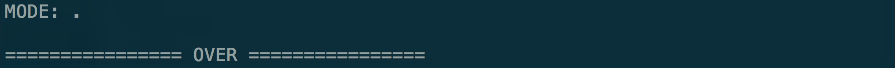

# Homework 1
## Due date: Nov. 4, 2016
### Development Environment
- Operating System: ***Mac***
- IDE: ***Sublime Text 3***
- Compiler: ***g++***
- C++ Version: at least ***C++11***

### Usage Guide
1. Open your terminal and change to folder directory
>- Goto step 3 if you already have your `.o` or `.out` file

2. Compile:
> Type in `g++ -std=c++11 main.cpp myString.cpp`

3. Run:
> Type in `./a.out` or `./[outputName]`

4. Result: 
>- GO: Enter S
> 
>- MENU: Choose MODE (Enter other letters to quit)
> 
>- FREQUENCY: Enter str to get frequency from S *(Leave str blank to return to MENU)*
> 
>- CHARACTER DELETE: Enter str to delete from S *(Leave str blank to return to MENU)*
> 
>- OVER: Terminate program
> 