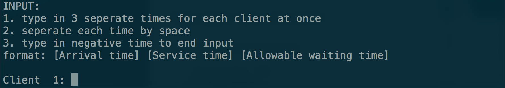
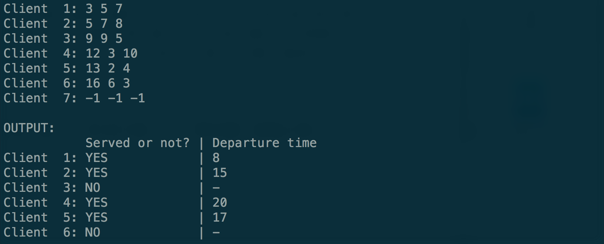

# Homework 2
## Due date: Nov. 20, 2016
### Development Environment
- Operating System: ***Mac***
- IDE: ***Sublime Text 3***
- Compiler: ***g++***
- C++ Version: at least ***C++11***

### Usage Guide
1. Open your terminal and change to folder directory
>- Goto step 3 if you already have your `.o` or `.out` file

2. Compile:
> Type in `g++ -std=c++11 main.cpp baseClient.cpp serviceQueue.cpp`

3. Run:
> Type in `./a.out` or `./[outputName]`

4. Result: 
>- INPUT: Enter the three needed times for each client *(Enter less than 10 clients by giving any of the three numbers negative.)*
> 
>- OUTPUT: Generate answers after input is done
> 

<!-- Hint: Written in MarkDown Language, can also be compiled into HTML -->