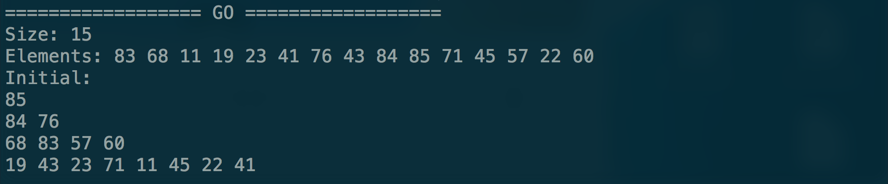
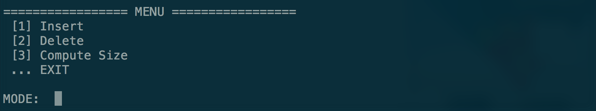
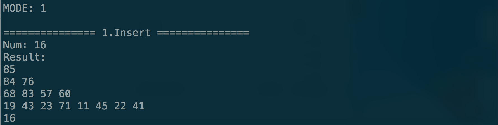
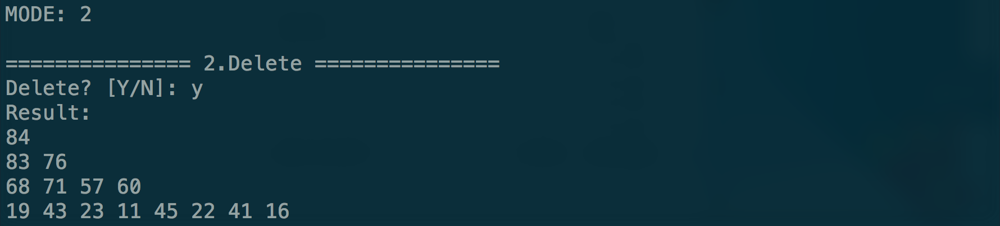
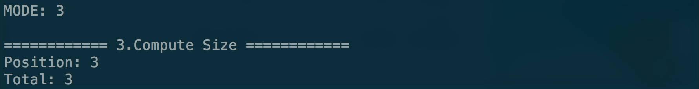
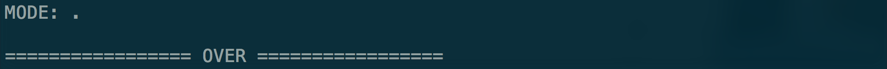

# Homework 3
## Due date: Dec. 14, 2016
### Development Environment
- Operating System: ***Mac***
- IDE: ***Sublime Text 3***
- Compiler: ***g++***
- C++ Version: at least ***C++11***

### Usage Guide
1. Open your terminal and change to folder directory
>- Goto step 3 if you already have your `.o` or `.out` file

2. Compile:
> Type in `g++ -std=c++11 main.cpp maxQueue.cpp`

3. Run:
> Type in `./a.out` or `./[outputName]`

4. Result: 
>- GO: Enter Size and Elements *(Queue initialization)*
> 
>- MENU: Choose MODE *(Enter other letters to quit)*
> 
>- INSERT: Enter Num *(Queue insertion)*
> 
>- DELETE: Delete first element of queue *(Y to confirm, N to cancel)*
> 
>- COMPUTE SIZE: Enter Position *(Compute size of left subtree)*
> 
>- OVER: Terminate program
> 

<!-- Hint: Written in MarkDown Language, can also be compiled into HTML -->