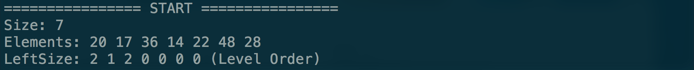
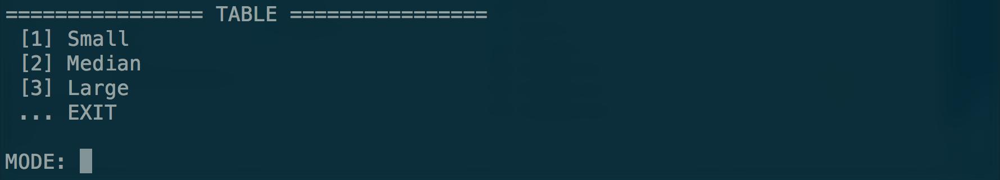
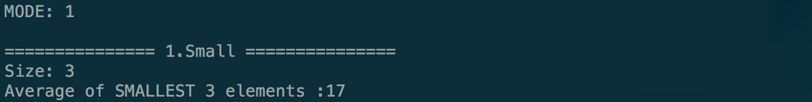
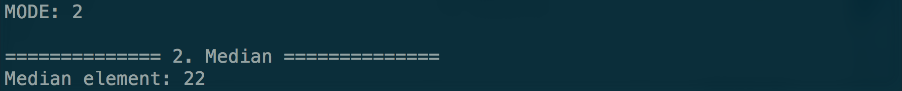
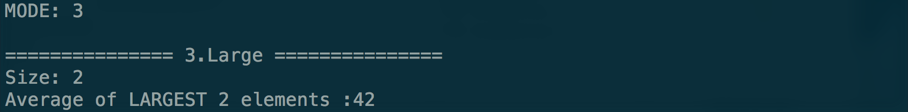
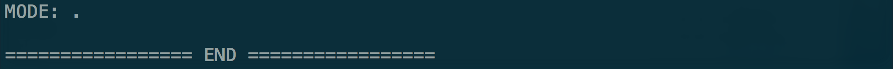

# Homework 4
## Due date: Dec. 27, 2016
### Development Environment
- Operating System: ***Mac***
- IDE: ***Sublime Text 3***
- Compiler: ***g++***
- C++ Version: at least ***C++11***

### Usage Guide
1. Open your terminal and change to folder directory
>- Goto step 3 if you already have your `.o` or `.out` file

2. Compile:
> Type in `g++ -std=c++11 main.cpp threadBST.cpp threadNode.cpp`

3. Run:
> Type in `./a.out` or `./[outputName]`

4. Result: 
>- START: Enter Size and Elements *(BST initialization)*
> 
>- TABLE: Choose MODE *(Enter other letters to quit)*
> 
>- SMALL: Enter Size *(Compute average of smallest elements)*
> 
>- MEDIAN: Get median elements
> 
>- LARGE: Enter Size *(Compute average of laragest elements)*
> 
>- END: Terminates program
> 

<!-- Hint: Written in MarkDown Language, can also be compiled into HTML -->